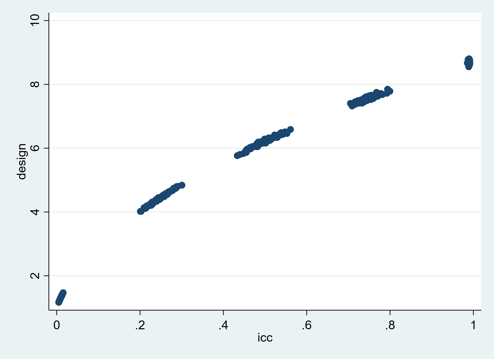

# WEEK 8 HW - Group 3

## Motivation

### ICC

The intracluster correlation coefficient is a measure of how clustered data are related. Considering this can prevent falsely reporting significance. 

This is because similarity among the observations in clusters makes it more difficult to detect the true differences between study arms by reducing response variability. The ICC measures this similarity by comparing within cluster variance to between cluster variance.

Note that accounting for similarities among clustered subjects usually results in power loss. Then, more subjects are required.

A high icc ($\rho$) represents comparatively high "between clusters" variance.

If $\rho=1$, then all responses within a cluster are identical.

If $\rho=0$, then there is no correlation of responses within a cluter.

### Design Effect

The design effect is a correction factor used to adjust the required sample size for cluster sampling to make up for info lost from the clustered design.

A larger ICC often means a larger design effect, so the sample size would have to increase.

## simulate.do Description

Our goal is to create "data" across 200 clusters, which are schools in our case.

In particular, we have defined an rclass program that uses the intracluster correlation coefficient ("ICC") as an input to the data generation process.

To use the program, type [schools, rho(VALUE)] where "VALUE" is the ICC you want to look at. Notably this must be between 0 and 1.

We then set the number of schools (clusters) to 200 and generate a way to refer to each of them.

By generating n_students and expanding, we are randomizing the number of students per school and essentially replacing each school observation with "n_students" many copies.

Then we generate (student) ids to differentiate the observations in each cluster.

### Intracluster correlation in the data

Now we are able to generate intracluster correlation in the data. One of our assumptions is that the total variance (variance between clusters + variance within clusters) = 1.

We generated test scores as our outcome variable. 

$$Y_{ij} = \mu + u_j + \epsilon_{ij}$$,
where $Y_{ij}$ is the outcome for student $i$ at school $j$, $u_j$ is a "school effect" (var between clusters), and $\epsilon_{ij}$ is the source of variance within clusters.

Notably $u_j$ is the same for all students within a school.

Also, test scores are capped at 100 and have a floor of 0.

We then generated some other characteristic variables:
- number of absences: normally distributed with mean and stdev of 3, but with a floor of 0.
- number of disciplinary actions received: generated in such a way that students receive some sort of disciplinary action for every 3 absences. In addition, non-attendance related disciplinary actions come from a uniform distribution on the interval (0,3).
- body mass index or BMI (as a health measure): normal distribution with mean 20, stdev 2.
- whether a student received free/reduced-price lunch: generated from runiform(0,1), but rounded so that this is an indicator variable (only 0's and 1's).

A multilevel mixed-effects regression reveals how correlated scores are within the same school, conditional on the covariates. We get the icc in the data.

Then we estimate the design effect.

We later create a new variable that is the mean of subjects sampled in each cluster.

Then we calculated the design effect.

## results.do Description

results.do sets the working directory, a randomization seed, and then loads the schools program defined in simulate.do. 

Then it runs the program with different ICC values (0.01, 0.25, 0.5, 0.75, and 0.99), running each 100 times and storing the results in the results matrix.

We store the columns from the results matrix as new variables that we use to create a scatter plot of the design effect and the icc. 

Clearly, a larger icc corresponds to a larger design effect. This implies that the sample size has to be increased when there is high variance between clusters.

Then we export this scatterplot.

We also export a csv _____.
