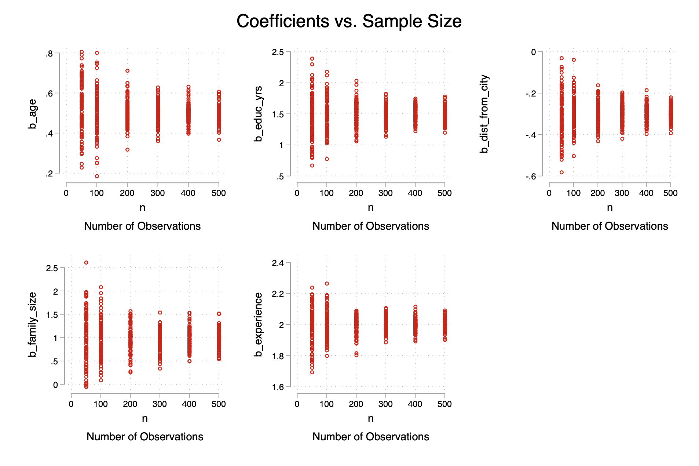

# Week 8 Homework Assignment, Group 4: income_sim

# `simulate.do` Overview

# Our simulate.do file defines a rclass program which takes in sample size as an input.
# The program firstly creates an index variable `id` to serve as identification, for each variable in the sample size.
# It creates a `state` variable which ranges from 1 to 10, evenly distributed across observations. For the purpose of the simulation, it is assumed that a higher value for the `state` variable signifies a more urban state.
# Then, the program generates 5 additional variables.

# `age`: distributed normally with a mean of 35 and a standard deviation of 5.

# `educ_yrs`: distributed normally with a mean of (12+(state/2)) and a standard deviation of 1. The floor is taken to ensure whole number values. This variable is positively correlated with state because urban areas tend to have higher levels of education.

# `dist_from_city`: distributed normally with a mean of (25-state) and a standard deviation of 5. This variable is negatively correlated with state because urban areas tend to have a lower distance to a major city.

# `family_size`: distributed normally with a mean of 4 and a standard deviation of 1.

# `experience`: distributed uniformly with a minimum of 0 and a maximum of age-18. The maximum value should be age-18 because a person should not have more work experience than if they were working since 18.

# the observations are dropped if `age`<18, `educ_yrs`<0, `dist_from_city`<0, or `family_size`<1.
# However, we constructed the means and standard deviations of these variables to be such that these safety restrictions are unlikely.

# The program then generates an income variable, named `income_k`, dependent on the previously generated variable. The process is defined below:

gen `income_k` = 2(`experience`) + .5(`age`) -.3(`dist_from_city`) + 1(`family_size`) + 1.5(`educ_yrs`) + rnormal(0,4)

# Coefficient specifications were chosen by hand such that the `income_k` variable generates reasonable values.

# Then, a regression is run with the variables, and is clustered by state, as follows:

reg `income_k` `age` `educ_yrs` `dist_from_city` `family_size` `experience`, cluster(`state`)

# The results are then stored and returned as local variables.

# `results.do` Overview

# Our results.do file runs the simulate.do file to load the simulate program and it sets a seed that we generated using random.org.
# It runs the `income_sim` program with different sample sizes, running each 100 times and storing the results in a matrix, `results`.
# It saves the matrix to the data and creates scatter plots of sample size vs coefficients, showing how as the sample size increases, the coefficients converge to their true values. It then combines the scatter plots into one graph and exports the graph. It then exports the data as a csv. 

